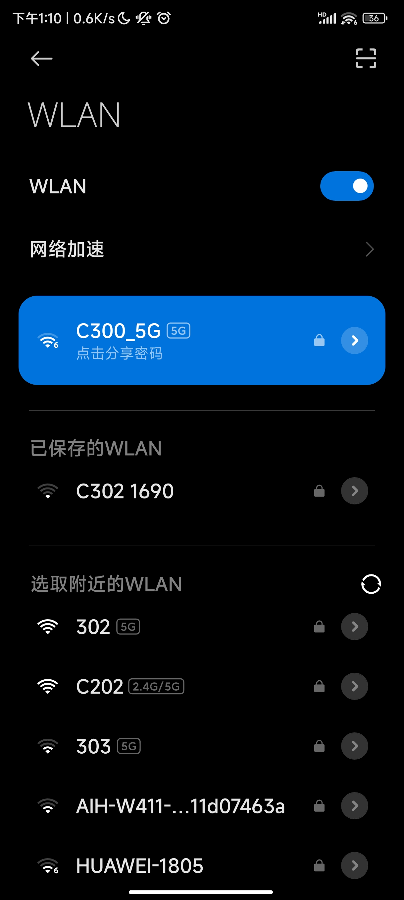

# 怎么在学校访问互联网

---

<h1>使用Windows电脑</h1>

首先，打开设置

点击网络和internet，选择代理

开启“使用代理服务器”

在地址中填入“10.88.202.71”，端口填入10001后
即可正常连接互联网

在地址中填入“10.88.202.71”，端口填入10002后
即可连接外网

然后，**点击保存**

**注意：外网访问速度较慢**.

<h1>使用手机</h1>

首先，打开手机的设置

连接C300_5G,此网络的密码是“pysyzx116”

然后，点击Wi-Fi，进入wifi设置页面

找到“代理”选项，将“代理”更改为“手动”模式

在地址中填入“10.88.202.71”，端口填入10001后
即可正常连接互联网

在地址中填入“10.88.202.71”，端口填入10002后
即可连接外网

<i>作者：Yuebi</i> 
<i>日期：2024年11月30日</i>

